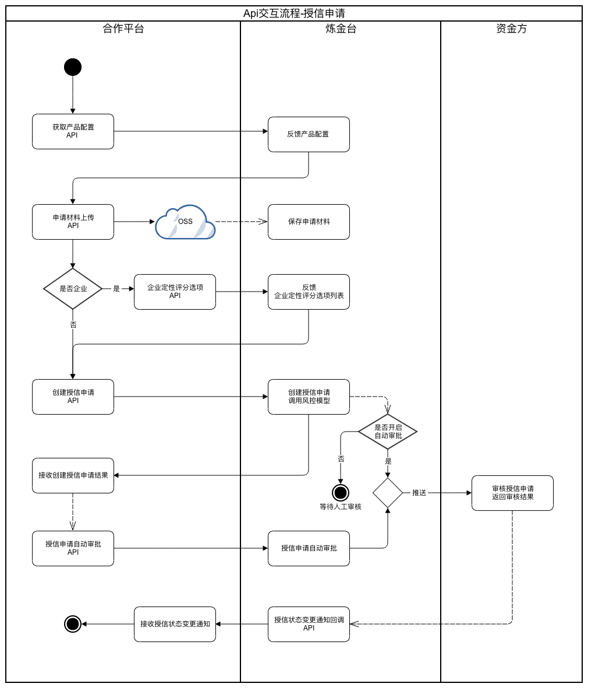

# 授信申请

#个贷申请相关接口
| 序号 | 名称 | 是否必须 | 描述 | 
| --- | --- | --- | --- | 
| 1 | [个贷产品配置](01_cs_fac_config.md) | 是 | 获取“个贷申请创建”授信需要传入的字段、上传的申请材料和上传申请材料密钥信息 |
| 2 | [上传申请材料](doc_upload.md) | 否 | 当申请有需要上传申请材料时需要调用，需要上传申请材料的配置在：[个贷产品配置](01_cs_fac_config.md)返回信息“doc”字段中获取 |
| 3 | [个人授信申请创建](02_cs_app_create.md)| 是|  "个人授信申请创建"API，根据[个贷产品配置](01_cs_fac_config.md)返回的信息，决定授信申请创建需要的参数信息。 |

#企贷申请相关接口
| 序号 | 名称 | 是否必须 | 描述 | 
| --- | --- | --- | --- | 
| 1 | [获取企贷产品配置](04_cp_fac_config.md) | 是 | 获取“企贷申请创建”授信需要传入的字段、上传的申请材料和上传申请材料密钥信息 |
| 2 | [上传申请材料](doc_upload.md) | 否 | 当申请有需要上传申请材料时需要调用，需要上传申请材料的配置在：[获取企贷产品配置](04_cp_fac_config.md)返回信息“doc”字段中获取 |
| 2 | [获取企业定性评分模型接口](06_cp_credit_model.md) | 是 | 获取企贷的评分模型。授权申请创建的时，根据返回的模型将每一个信用指标做出选择。然后把选择的结果和信用指标的cd提交给授信创建申请。具体的参照：[企贷申请创建](05_cp_app_create.md)的参数“ccms”的结构 |
| 3 | [企贷申请创建](05_cp_app_create.md)| 是|  "企业授信申请创建"API，根据[获取企贷产品配置](04_cp_fac_config.md)返回的信息，决定授信申请创建需要的参数信息。 |

注：在申请创建API中的参数，有一部分（字段名称后缀是“mt*Cd”格式结尾）的取值范围将采用字典定义。 
使用方式：使用[个贷产品配置](01_cs_fac_config.md)或者[获取企贷产品配置](04_cp_fac_config.md) 返回的信息名称在“[数据字典](/4_数据字典.md)”，搜寻对应的信息。

## 交互流程图
